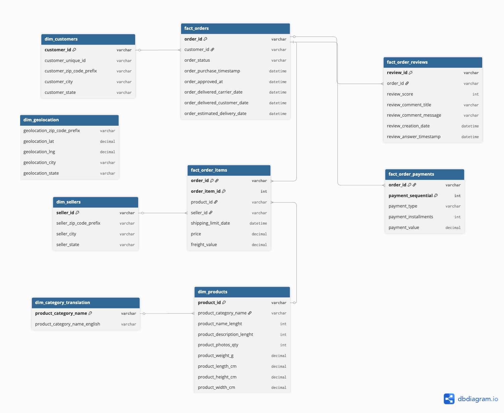

# Olist Platform Operational Health Analysis

Identifying the key operational drivers of order completion quality on Olist's e-commerce marketplace in Brazil.

## 📊 Project Overview

<!-- TODO: 2-3 句話說明這個專案的動機與定位。
建議包含:
- 這是什麼資料集、時間範圍
- 你想回答的核心問題
- 為什麼這個問題對平台營運重要
-->

## 🎯 Business Problem

The overarching business problem this project wants to tackle is: from an operations standpoint, what drives order completion quality on Olist's marketplace, and where should the platform intervene?

This project follows an integrated analytical narrative connecting five operational dimensions:

- **Delivery Logistics Efficiency**: How often do delays occur, and how much do they hurt the business?
- **Customer Satisfaction (Review Scores)**: How much do delays affect review scores, and how quickly does that effect appear?
- **Seller Performance**: Which sellers or regions are dragging down the platform's overall delivery performance?
- **Order Funnel Drop-off**: At which stage do the most orders drop off?
- **Payment Behavior**: How does payment method affect order value and completion rate?


<!-- TODO: Phase 3 完成後,補充你對這五條線如何串成一個完整故事的總結,
可以參考你目前已有的 integrated narrative:
"Seller concentration in the southeast → cross-state distance drives delays →
delay damage to customer experience is disproportionately front-loaded →
rating distribution inverts → each delayed order's reputational damage
far exceeds its share of order volume." -->

## 🗂️ Dataset

- **Source:** [Kaggle — Brazilian E-Commerce Public Dataset by Olist](https://www.kaggle.com/datasets/olistbr/brazilian-ecommerce)
- **Time range:** 2016–2018
- **Scope:** 9 relational tables covering orders, customers, sellers, products, payments, reviews, and geolocation

## 🛠️ Tech Stack

| Layer | Tools |
|---|---|
| Database | PostgreSQL 17.0 (Postgres.app) |
| ETL / Scripting | Python, pandas, SQLAlchemy, psycopg2-binary, python-dotenv |
| Analysis | SQL (via pgAdmin 4, VS Code SQLTools) |
| Notebooks | Jupyter |
| Visualization | Tableau Public |
| Schema Design | dbdiagram.io |
| Version Control | Git / GitHub |

## 🏗️ Architecture

A galaxy schema with four fact tables and five dimension tables. `dim_geolocation` is intentionally kept disconnected in Phase 1 and will be integrated in Phase 3's geographic analysis.



## 🔄 ETL Process

All 9 raw tables were cleaned via Jupyter notebooks in `/notebooks` and then imported into PostgreSQL, following a three-layer validation approach: **single-table cleaning → cross-table consistency → business logic validation**.

**Key decisions:**
- Deleted logically inconsistent delivered orders missing timestamps
- Added 2 calculated fields: `delivery_delay_days` and `estimated_delivery_days`
- Retained 610 products missing `product_category_name`, since removing them would orphan the `order_items` records referencing those `product_id`s and silently drop valid transactions from downstream analysis
- Removed 814 rows with duplicate `review_id`
- Aggregated geolocation data to zip-code-prefix level averages
- Resolved orphan records as a cross-table consistency step (not a single-table cleaning issue)
- Found 249 orders where payment totals and order-items totals differ by more than $1.00; deferred to Phase 2 for deeper investigation


## 🔍 Analysis Highlights

### Phase 1 — Delivery Logistics (Complete)

- **Overall delay rate:** 6.77% of orders arrive later than the estimated delivery date
- **Severity:** Delayed orders average +10.62 days late; on-time orders average 11.87 days early (large buffer built into estimates)
- **Trend:** Delay rate spiked to 12.40% during Black Friday (Nov 2017) and to 14–19% during the Feb–Mar 2018 logistics strike — delays are event-driven, not simply volume-driven
- **Geography:** Northeastern states (e.g. Alagoas at 21.41%) see the highest delay rates; cross-state shipments have nearly double the delay rate of same-state shipments (8.03% vs. 4.49%), driven by seller concentration in São Paulo (59.74% of all sellers)
- **Customer impact:** Average review score drops from 4.29 (on-time) to 2.27 (delayed); the rating distribution fully inverts from 5-star dominant (62.31%) to 1-star dominant (53.81%) once delay occurs, with most of the damage happening in the first 1–3 days of delay

<!-- TODO: 補充你 Tableau dashboard 的截圖或連結 -->

### Phase 2 — Deepening (In Progress)

<!-- TODO: 統計檢定結果(t-test)、賣家計分卡、funnel 分析、營收損失估算完成後填入 -->

### Phase 3 — Broadening (Planned)

<!-- TODO: 付款行為分析、負評 logistic regression、地理分析完成後填入 -->

## 📈 Dashboard

<!-- TODO: Tableau Public 連結
[View Interactive Dashboard on Tableau Public](your-link-here) -->

<!-- TODO: 截圖 -->

## 💡 Key Business Recommendations

<!-- TODO: Phase 2/3 完成後,整合成 2-4 條可執行建議,例如:
- 針對跨州出貨的高延遲路線,建議平台優先招募目標州當地賣家
- 針對延遲訂單,建議在延遲發生的前 1-3 天內主動介入(退款/補償/溝通),因為滿意度損害在此區間最劇烈
-->

## 📁 Repository Structure

```
olist-health-analysis/
├── README.md
├── README-assets/          # Schema diagrams, exported images
├── notebooks/              # ETL cleaning notebooks (Python)
├── scripts/
│   ├── load_to_postgres.py
│   ├── data_quality_check.py
│   └── export_sql_to_csv.py
├── sql/
│   ├── analysis/
│   │   ├── 01_delivery_overview.sql
│   │   ├── 02_delay_trend_over_time.sql
│   │   ├── 03_delay_by_state.sql
│   │   └── 04_delay_vs_review_score.sql
│   └── add_constraints.sql
├── tableau/                # Exported CSVs for Tableau (gitignored)
└── .gitignore
```

## 🔑 Key Learnings

- `pd.to_csv()` strips datetime type information — must explicitly map `dtype` on `to_sql()` to preserve TIMESTAMP columns through the round trip
- Orphan records are a cross-table consistency issue, distinct from single-table cleaning
- Order volume weakly predicts delay rate — delays are largely event-driven (external shocks like holidays or strikes), not purely a function of order volume
- Delay's impact on customer satisfaction is disproportionately front-loaded and nonlinear — the critical intervention window is within the first few days of a delay

<!-- TODO: Phase 2/3 的學習心得持續累加 -->

## 🗺️ Roadmap

- [x] **Phase 1:** Schema design, ETL, delivery delay analysis, dashboard
- [ ] **Phase 2:** Statistical testing (delay vs. review score), seller scorecards, order funnel analysis, revenue loss estimation
- [ ] **Phase 3:** Payment behavior analysis, logistic regression for negative review prediction, state-level geographic analysis, final recommendations

## 👤 Author

**Cynthia Yu** \
[LinkedIn](https://www.linkedin.com/in/cynthia-tinghuan-yu/) \
Last update: July 27th, 2026
